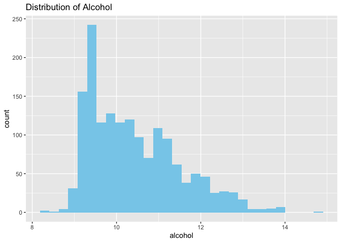
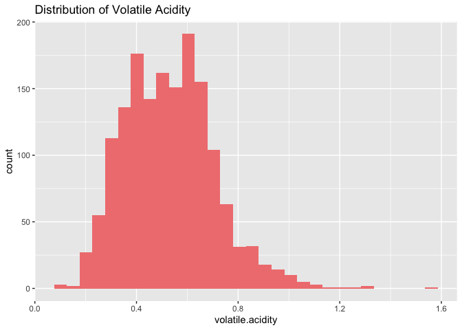
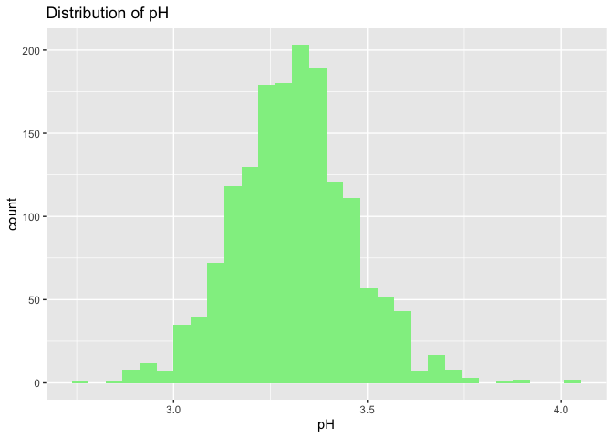
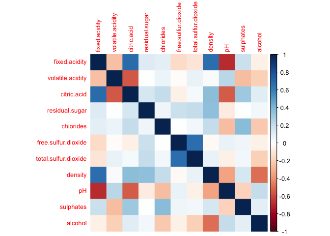
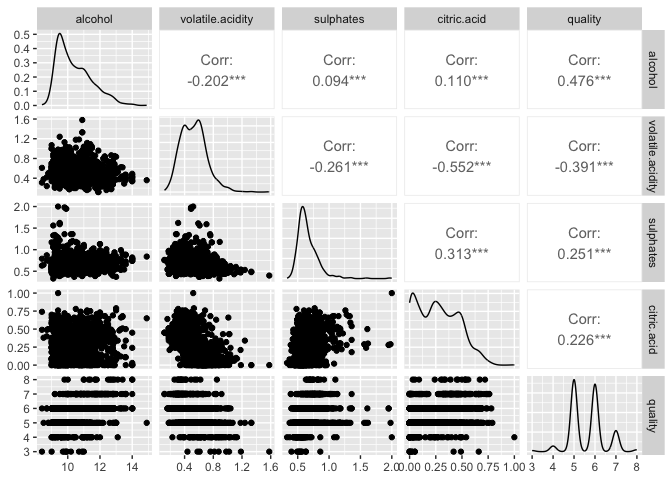
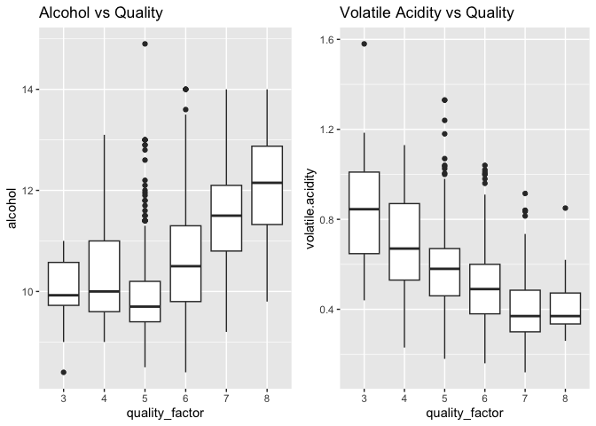
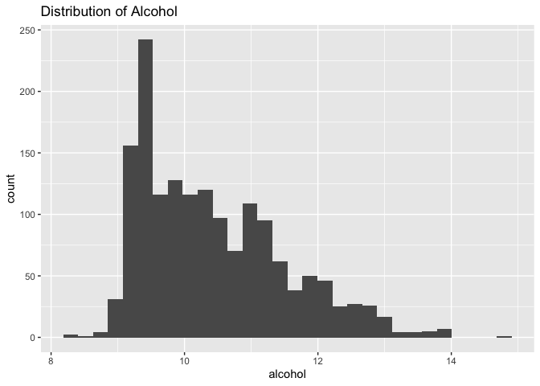

    install.packages("corrplot", repos = "http://cran.us.r-project.org")

    ## 
    ## The downloaded binary packages are in
    ##  /var/folders/qp/11c2sykd59dc_8h4549nm36h0000gn/T//RtmpQxLELg/downloaded_packages

    # Load necessary libraries
    library(tidyverse)

    ## ── Attaching core tidyverse packages ──────────────────────── tidyverse 2.0.0 ──
    ## ✔ dplyr     1.1.4     ✔ readr     2.1.5
    ## ✔ forcats   1.0.0     ✔ stringr   1.5.1
    ## ✔ ggplot2   3.5.1     ✔ tibble    3.2.1
    ## ✔ lubridate 1.9.4     ✔ tidyr     1.3.1
    ## ✔ purrr     1.0.4     
    ## ── Conflicts ────────────────────────────────────────── tidyverse_conflicts() ──
    ## ✖ dplyr::filter() masks stats::filter()
    ## ✖ dplyr::lag()    masks stats::lag()
    ## ℹ Use the conflicted package (<http://conflicted.r-lib.org/>) to force all conflicts to become errors

    library(dplyr)
    library(ggplot2)
    library(corrplot)

    ## corrplot 0.95 loaded

    library(gridExtra)

    ## 
    ## Attaching package: 'gridExtra'
    ## 
    ## The following object is masked from 'package:dplyr':
    ## 
    ##     combine

## – Business Understanding –

## What makes a good quality wine? 🍷

Based on the research, wine producers want to identify controllable
factors that could help improve product quality, particularly in
chemical composition of wine. A high-quality wine is influenced by a
combination of chemical, sensory, and structural attributes. Research
and industry analysis highlights factors like **alcohol content**,
**acidity**, **sugar levels**, and **volatile acidity** as crucial to
consumer perception and expert ratings. Higher alcohol levels are linked
to better body and richness, and lower volatile acidity is linked to
cleaner, more pleasant aromas. **Citric acid** also contributes to a
wine’s freshness, and **sulphates** help preserve wine and enhance
structure. Additionally, **pH levels** and **density** affect the wine’s
stability, fermentation quality, and taste balance. Understanding how
all these variables interact allows producers to refine fermentation and
aging processes to make more desirable wines.

## – Data Understanding –

## General info about the dataset

1.  **Dataset:** UCI Wine Quality Dataset
2.  **Samples:** 1,599 red wines
3.  **Features:** 11 numeric chemical properties + 1 quality rating
4.  **Target variable:** `quality` (integer from 0-10, treated as
    ordinal)
5.  **Feature types:** all features are **ratio** (ex/ pH, alcohol,
    sulphates)

<!-- -->

    # Download red wine dataset
    wine <- read.csv("https://archive.ics.uci.edu/ml/machine-learning-databases/wine-quality/winequality-red.csv", sep = ";")

    # Check structure of data
    str(wine)

    ## 'data.frame':    1599 obs. of  12 variables:
    ##  $ fixed.acidity       : num  7.4 7.8 7.8 11.2 7.4 7.4 7.9 7.3 7.8 7.5 ...
    ##  $ volatile.acidity    : num  0.7 0.88 0.76 0.28 0.7 0.66 0.6 0.65 0.58 0.5 ...
    ##  $ citric.acid         : num  0 0 0.04 0.56 0 0 0.06 0 0.02 0.36 ...
    ##  $ residual.sugar      : num  1.9 2.6 2.3 1.9 1.9 1.8 1.6 1.2 2 6.1 ...
    ##  $ chlorides           : num  0.076 0.098 0.092 0.075 0.076 0.075 0.069 0.065 0.073 0.071 ...
    ##  $ free.sulfur.dioxide : num  11 25 15 17 11 13 15 15 9 17 ...
    ##  $ total.sulfur.dioxide: num  34 67 54 60 34 40 59 21 18 102 ...
    ##  $ density             : num  0.998 0.997 0.997 0.998 0.998 ...
    ##  $ pH                  : num  3.51 3.2 3.26 3.16 3.51 3.51 3.3 3.39 3.36 3.35 ...
    ##  $ sulphates           : num  0.56 0.68 0.65 0.58 0.56 0.56 0.46 0.47 0.57 0.8 ...
    ##  $ alcohol             : num  9.4 9.8 9.8 9.8 9.4 9.4 9.4 10 9.5 10.5 ...
    ##  $ quality             : int  5 5 5 6 5 5 5 7 7 5 ...

    # Distribution plots to check skewness and outliers
    ggplot(wine, aes(x = alcohol)) + geom_histogram(bins = 30, fill = "skyblue") + ggtitle("Distribution of Alcohol")

    ggplot(wine, aes(x = volatile.acidity)) + geom_histogram(bins = 30, fill = "lightcoral") + ggtitle("Distribution of Volatile Acidity")

    ggplot(wine, aes(x = pH)) + geom_histogram(bins = 30, fill = "lightgreen") + ggtitle("Distribution of pH")

    # Check for missing values
    cat("Missing values:", sum(is.na(wine)))

    ## Missing values: 0

The dataset contains 1599 samples and 14 variables, all numeric. We see
the distribution of alcohol plot is right-skewed, the distribution of
volatile acidity is slightly right-skewed, and the distribution of pH is
approximately normal (not skewed), with a symmetric spread.

## What type of data do these attributes hold?

Data Type Attributes **Nominal** (Categorical, Unordered): no variables
**Ordinal** (Categorical, Ordered): quality, quality\_factor
**Interval**: pH **Ratio**: fixed acidity, volatile acidity, citric
acid, residual sugar, chlorides, free sulfur dioxide, total sulfur
dioxide, density, sulphates, and alcohol

## – Data Preparation –

## How was the data loaded? Were any changes made to it?

The data was loaded from a CSV file (`winequality-red.csv`). No missing
values were found. It created a categorical version of `quality` for
boxplot visualization, and created a binary label `good` = 1 if quality
&gt;= 7, else 0

    # Basic dimensions
    cat("Number of samples: ", nrow(wine), "\n")

    ## Number of samples:  1599

    cat("Number of features (excluding quality): ", ncol(wine)-1, "\n")

    ## Number of features (excluding quality):  11

    # View column names
    colnames(wine)

    ##  [1] "fixed.acidity"        "volatile.acidity"     "citric.acid"         
    ##  [4] "residual.sugar"       "chlorides"            "free.sulfur.dioxide" 
    ##  [7] "total.sulfur.dioxide" "density"              "pH"                  
    ## [10] "sulphates"            "alcohol"              "quality"

    # Summary statistics for all features
    summary(wine)

    ##  fixed.acidity   volatile.acidity  citric.acid    residual.sugar  
    ##  Min.   : 4.60   Min.   :0.1200   Min.   :0.000   Min.   : 0.900  
    ##  1st Qu.: 7.10   1st Qu.:0.3900   1st Qu.:0.090   1st Qu.: 1.900  
    ##  Median : 7.90   Median :0.5200   Median :0.260   Median : 2.200  
    ##  Mean   : 8.32   Mean   :0.5278   Mean   :0.271   Mean   : 2.539  
    ##  3rd Qu.: 9.20   3rd Qu.:0.6400   3rd Qu.:0.420   3rd Qu.: 2.600  
    ##  Max.   :15.90   Max.   :1.5800   Max.   :1.000   Max.   :15.500  
    ##    chlorides       free.sulfur.dioxide total.sulfur.dioxide    density      
    ##  Min.   :0.01200   Min.   : 1.00       Min.   :  6.00       Min.   :0.9901  
    ##  1st Qu.:0.07000   1st Qu.: 7.00       1st Qu.: 22.00       1st Qu.:0.9956  
    ##  Median :0.07900   Median :14.00       Median : 38.00       Median :0.9968  
    ##  Mean   :0.08747   Mean   :15.87       Mean   : 46.47       Mean   :0.9967  
    ##  3rd Qu.:0.09000   3rd Qu.:21.00       3rd Qu.: 62.00       3rd Qu.:0.9978  
    ##  Max.   :0.61100   Max.   :72.00       Max.   :289.00       Max.   :1.0037  
    ##        pH          sulphates         alcohol         quality     
    ##  Min.   :2.740   Min.   :0.3300   Min.   : 8.40   Min.   :3.000  
    ##  1st Qu.:3.210   1st Qu.:0.5500   1st Qu.: 9.50   1st Qu.:5.000  
    ##  Median :3.310   Median :0.6200   Median :10.20   Median :6.000  
    ##  Mean   :3.311   Mean   :0.6581   Mean   :10.42   Mean   :5.636  
    ##  3rd Qu.:3.400   3rd Qu.:0.7300   3rd Qu.:11.10   3rd Qu.:6.000  
    ##  Max.   :4.010   Max.   :2.0000   Max.   :14.90   Max.   :8.000

    head(wine)

    ##   fixed.acidity volatile.acidity citric.acid residual.sugar chlorides
    ## 1           7.4             0.70        0.00            1.9     0.076
    ## 2           7.8             0.88        0.00            2.6     0.098
    ## 3           7.8             0.76        0.04            2.3     0.092
    ## 4          11.2             0.28        0.56            1.9     0.075
    ## 5           7.4             0.70        0.00            1.9     0.076
    ## 6           7.4             0.66        0.00            1.8     0.075
    ##   free.sulfur.dioxide total.sulfur.dioxide density   pH sulphates alcohol
    ## 1                  11                   34  0.9978 3.51      0.56     9.4
    ## 2                  25                   67  0.9968 3.20      0.68     9.8
    ## 3                  15                   54  0.9970 3.26      0.65     9.8
    ## 4                  17                   60  0.9980 3.16      0.58     9.8
    ## 5                  11                   34  0.9978 3.51      0.56     9.4
    ## 6                  13                   40  0.9978 3.51      0.56     9.4
    ##   quality
    ## 1       5
    ## 2       5
    ## 3       5
    ## 4       6
    ## 5       5
    ## 6       5

    # Data types of features
    sapply(wine, class)

    ##        fixed.acidity     volatile.acidity          citric.acid 
    ##            "numeric"            "numeric"            "numeric" 
    ##       residual.sugar            chlorides  free.sulfur.dioxide 
    ##            "numeric"            "numeric"            "numeric" 
    ## total.sulfur.dioxide              density                   pH 
    ##            "numeric"            "numeric"            "numeric" 
    ##            sulphates              alcohol              quality 
    ##            "numeric"            "numeric"            "integer"

    # Manual classification of feature types
    feature_types <- tibble(Feature = names(wine), 
                            Role = ifelse(names(wine) == "quality", "Target", "Predictor"), 
                            Type = ifelse(names(wine) == "quality", "Ordinal", "Ratio"))
    print(feature_types)

    ## # A tibble: 12 × 3
    ##    Feature              Role      Type   
    ##    <chr>                <chr>     <chr>  
    ##  1 fixed.acidity        Predictor Ratio  
    ##  2 volatile.acidity     Predictor Ratio  
    ##  3 citric.acid          Predictor Ratio  
    ##  4 residual.sugar       Predictor Ratio  
    ##  5 chlorides            Predictor Ratio  
    ##  6 free.sulfur.dioxide  Predictor Ratio  
    ##  7 total.sulfur.dioxide Predictor Ratio  
    ##  8 density              Predictor Ratio  
    ##  9 pH                   Predictor Ratio  
    ## 10 sulphates            Predictor Ratio  
    ## 11 alcohol              Predictor Ratio  
    ## 12 quality              Target    Ordinal

    # Create factor version of quality for plotting and testing
    wine$quality_factor <- factor(wine$quality)

## – EDA: Exploratory Data Analysis & Modeling –

## Correlation Matrix and Scatterplot Matrix

-   **Alcohol:** Positively correlated with quality
-   **Volatile Acidity:** Negatively correlated with quality
-   **Density:** Negatively correlated with alcohol

We want to understand how each chemical property relates to wine
quality. A correlation matrix shows the strength and direction of
relationships between variables.

    # Correlation matrix
    corrplot(cor(wine[, 1:11]), method = "color", tl.cex = 0.8)

    # Scatterplot matrix
    GGally::ggpairs(wine[, c("alcohol", "volatile.acidity", "sulphates", "citric.acid", "quality")])

    ## Registered S3 method overwritten by 'GGally':
    ##   method from   
    ##   +.gg   ggplot2

 From this
correlation matrix, we observed that alcohol has a positive correlation
with quality, while volatile acidity has a negative correlation.

## Boxplots by Wine Quality

# We create boxplots to visualize how alcohol and volatile acidity vary by wine quality

    p1 <- ggplot(wine, aes(x = quality_factor, y = alcohol)) + geom_boxplot() + ggtitle("Alcohol vs Quality")
    p2 <- ggplot(wine, aes(x = quality_factor, y = volatile.acidity)) + geom_boxplot() + ggtitle("Volatile Acidity vs Quality")

    grid.arrange(p1, p2, ncol = 2)

 From this
boxplot visualization, we observed that higher quality wines tend to
have higher alcohol and lower volatile acidity.

## Histogram to show distribution of key variables

    ggplot(wine, aes(x = alcohol)) + geom_histogram(bins = 30) + ggtitle("Distribution of Alcohol")

## Hypothesis Testing

## What is my hypothesis?

H0: Mean alcohol content of quality 5 and quality 7 wines are equal Ha:
Mean alcohol content of quality 7 wines is higher

T-test shows statistically significant difference in **alcohol content**
between wines rated 5 vs. 7 (`p < 0.05`)

    # Check normality assumptions for each group
    shapiro.test(wine$alcohol[wine$quality == 5])

    ## 
    ##  Shapiro-Wilk normality test
    ## 
    ## data:  wine$alcohol[wine$quality == 5]
    ## W = 0.84302, p-value < 2.2e-16

    shapiro.test(wine$alcohol[wine$quality == 7])

    ## 
    ##  Shapiro-Wilk normality test
    ## 
    ## data:  wine$alcohol[wine$quality == 7]
    ## W = 0.99166, p-value = 0.3108

    # Check variance equality
    var.test(wine$alcohol[wine$quality == 5], wine$alcohol[wine$quality == 7])

    ## 
    ##  F test to compare two variances
    ## 
    ## data:  wine$alcohol[wine$quality == 5] and wine$alcohol[wine$quality == 7]
    ## F = 0.58625, num df = 680, denom df = 198, p-value = 9.083e-07
    ## alternative hypothesis: true ratio of variances is not equal to 1
    ## 95 percent confidence interval:
    ##  0.4651724 0.7285736
    ## sample estimates:
    ## ratio of variances 
    ##           0.586247

    # Running t-test
    t.test(alcohol ~ quality_factor, data = wine %>% filter(quality %in% c(5, 7)))

    ## 
    ##  Welch Two Sample t-test
    ## 
    ## data:  alcohol by quality_factor
    ## t = -21.222, df = 269.35, p-value < 2.2e-16
    ## alternative hypothesis: true difference in means between group 5 and group 7 is not equal to 0
    ## 95 percent confidence interval:
    ##  -1.711504 -1.420909
    ## sample estimates:
    ## mean in group 5 mean in group 7 
    ##        9.899706       11.465913

We checked the normality assumption for each group using the
Shapiro-Wilk test. Both groups show slight deviation from normality (p
&lt; .05), but the t-test is strong to normality violations with large
samples. We also check for equal variance using the F-test.

## Logistic Regression (Good vs. Bad Wine)

Predicts whether a wine is “good” (`quality` &gt;= 7) based on the
selected chemical properties. Using alcohol, volatile acidity,
sulphates, and citric acid as predictors.

    wine$good <- ifelse(wine$quality >= 7, 1, 0)

    model <- glm(good ~ alcohol + volatile.acidity + sulphates + citric.acid, data = wine, family = binomial)
    summary(model)

    ## 
    ## Call:
    ## glm(formula = good ~ alcohol + volatile.acidity + sulphates + 
    ##     citric.acid, family = binomial, data = wine)
    ## 
    ## Coefficients:
    ##                  Estimate Std. Error z value Pr(>|z|)    
    ## (Intercept)      -13.1586     1.1252 -11.694  < 2e-16 ***
    ## alcohol            1.0114     0.0814  12.424  < 2e-16 ***
    ## volatile.acidity  -3.5839     0.6854  -5.229 1.70e-07 ***
    ## sulphates          2.4424     0.4488   5.442 5.27e-08 ***
    ## citric.acid        0.9378     0.5270   1.780   0.0751 .  
    ## ---
    ## Signif. codes:  0 '***' 0.001 '**' 0.01 '*' 0.05 '.' 0.1 ' ' 1
    ## 
    ## (Dispersion parameter for binomial family taken to be 1)
    ## 
    ##     Null deviance: 1269.92  on 1598  degrees of freedom
    ## Residual deviance:  914.11  on 1594  degrees of freedom
    ## AIC: 924.11
    ## 
    ## Number of Fisher Scoring iterations: 6

Alcohol is a statistically significant positive predictor of `good` wine
(p &lt; .05), while volatile acidity negatively predicts quality.
Sulphates and citric acid also contribute positively, though smaller
effect sizes.

## – Actionable Insights –

## What are my observations?

Running a correlational analysis, my observations are that there is a
strong negative correlation between alcohol and density, and alcohol has
a strong positive correlation with quality. 1. **Increase Alcohol
Content** Strongest predictor of higher quality 2. **Lower Volatile
Acidity** Associated with better taste and aroma 3. **Optimize Sulphates
and Citric Acid** Can improve preservation and perceived freshness
